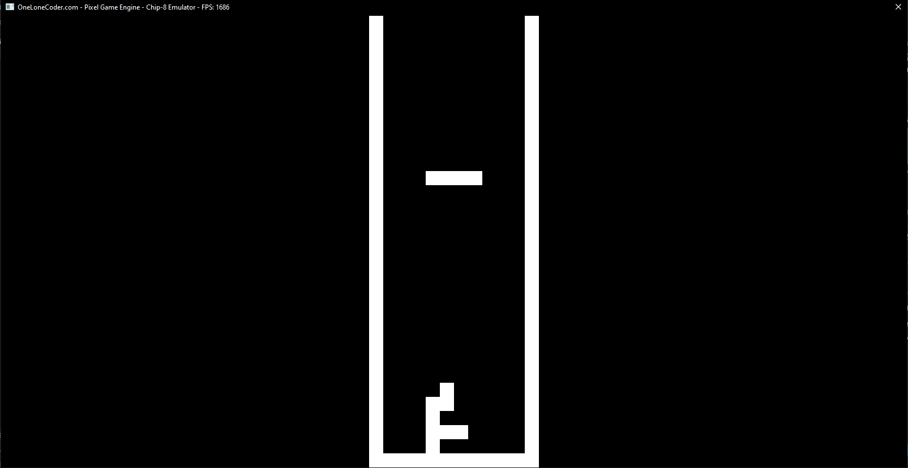
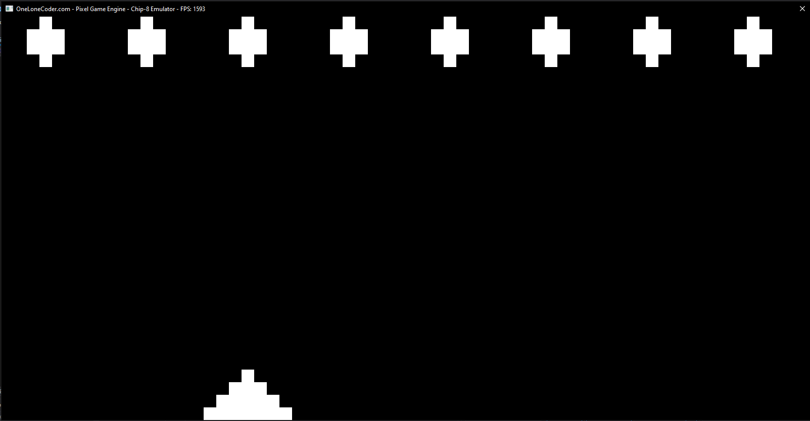
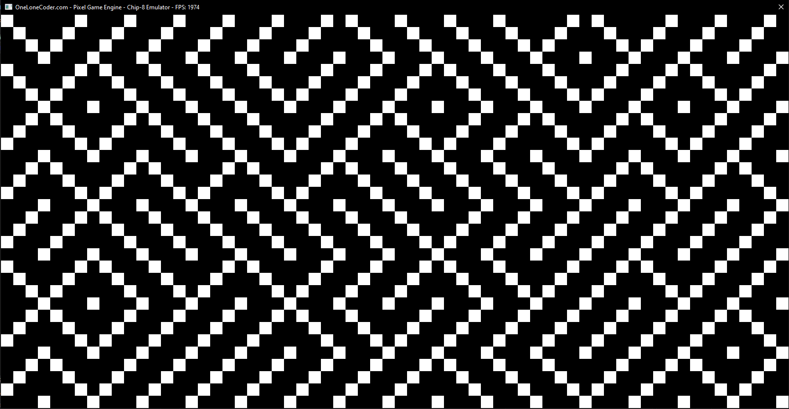

# Chip-8 Emulator

###### A Chip-8 Emulator built using C++ and the olc::PixelGameEngine.

### Screenshots:

*Tetris*

*Missile*

*Maze*

### Resources used:
*https://github.com/OneLoneCoder/olcPixelGameEngine/wiki
*https://austinmorlan.com/posts/chip8_emulator/ (Used most)
*http://www.multigesture.net/articles/how-to-write-an-emulator-chip-8-interpreter/
*https://en.wikipedia.org/wiki/CHIP-8
*http://devernay.free.fr/hacks/chip8/C8TECH10.HTM